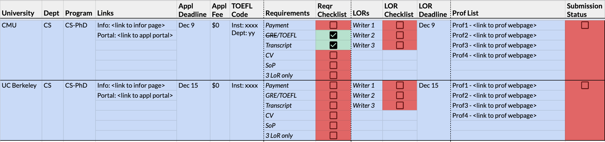

# managing applications

Applying to grad school can be stressful, confusing, and chaotic. This is especially the case when you are parallely studying for your finals, working at industry, or completing research. <i>I found introducing systematic procedures to apply and manage applications helps a ton</i>. Here are some things I did:

#### 1. Advisors >> University

Before you begin applying, you need to <b>know where to apply</b>. If you are here, you may already know the phrase "Advisor(s) matters more than the university". So why not start there? Look up potential advisors, their recent papers, webpages, research areas, etc. Make a list of professors that <b>you'd love to work with</b>. Focusing only on the the work that deeply interests you makes this much easier than it seems.

Use a clean way to record this list of advisors. For instance, I used an excel template, as shown below, with (1) Prof Name, (2) University, (3) Department, (4) Webpage, & (5) Notes on their work. From this list, I then picked universities where there were `>=3` `actively publishing` professors who brought `multiple research perspectives`.

Note: The above described process takes time and effort and there are no shortcuts to this. Again, starting early is an effective way to tackle this.

#### 2. Finalize Universities

Once you have a list of universities + advisors, you can decide how many universities you want to apply to. Please consider monetory factors such as application fees, scholarships, etc. I applied to 12 schools, which is on the higher end of things. In my opinion, assuming you can afford it, an ideal number would be `7-10 schools`.

#### 3. Manage Applications

Applications have too many moving parts constrained by deadlines -- SoPs, LoRs, Test Scores, Transcripts, CV, etc. I found having access to the status of all these factors, for every application, in a single place was extremely useful. 

To that regard, I created another excel template (shown below) with a checklisting mechansism. Ticking off things not only felt satisfying, but also gave a quick view of my overally progress. Here is a link to the <a href="https://docs.google.com/spreadsheets/d/100wb0sIbWBW9Nz8Glku2Wvp71aToijHpoWQ2-BZ1DDA/edit?usp=sharing"> google sheet template</a>. Feel free to create a copy and use it :)

Overall, using such systematic procedures helped me reduce mistakes, handle deadlines, and complete applications with minimal stress. I hope this helps you do the same. Good luck with your applications. 🤞
