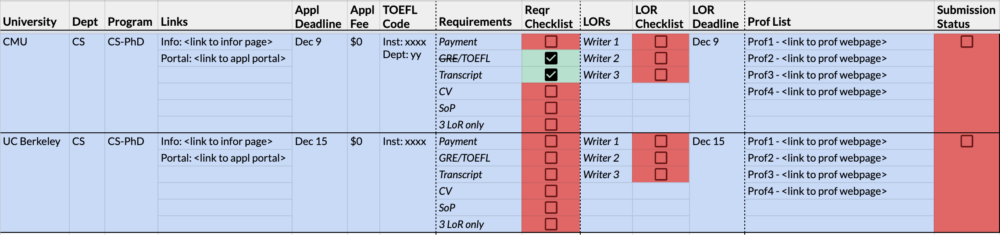

# letters of recommendation

Opinions may vary on aspects that matter in an application, but there is a strong consensus on what matters the most: ***Research Experience***.
For those hiring, research experience can be the best (and also easiest to access) predictor of success in a Ph.D. program. Hence, it becomes critical to employ your best strategies to show evidences of research experience. An applicant can do so in 3 places:

1. Resume (more on this coming up!)
2. Statement of purpose (see here for [my experiences with SoPs](./SoP.html))
3. **Letters of recommendation**

While `1.` is important, it is simply a summary of your achievements. Research is generally more than just what you achieved -- it involves experiments, engagement, leadership, collaboration, great ideas and those that failed. These are all aspects the admission committee (read professors) want to know to understand you. Some of this can be stated in `2.`, but it will still be a first person account, and hence, cover limited facets of your experience. This is where letters of reference (usually 3) help -- collectively vouching for your experience and highlighting various abilities. Here, your aim should be to get "good" letters of recommendation, and not three.

## The letter writer conundrum

Every applicant will ask themselves a question during this process: *"Who should I get letters from?"* Now, this can be challenging for various reasons: You may not know 3 professors/researchers who can vouch for you; You might know 3 writers, but your relationships are not research related; Your writiers were not deep contacts, and most probably will write superficial stuff about you; Your letter writers may have never written an LoR before!!!

To simplify this, the most important thing to remember is that your letters must **collectively** document a story about you. This means that each letter individually need not be PERFECT. It also means that all three letters do not have to talk about how amazing your research skills are -- some can talk more about leadership during a paper, planning a project, presentations, and much more that is still relevant to pursuing a PhD. Finally, this implies that all 3 of your writers do not need to be deep research contacts from top institutions or professors. A quality letter from any writer is better than a superficial one from from a well-known professor.

## The solution

You can look at this is solving an optimization problem: 
> *Which combination of `3` writers can effectively highlight the `K` facets relevant to my application?*

Now, the easiest way to solve this problem is to stop procrastinating and start building a network of advisors. Getting a good letter requires the letter writer to know you (at least, parts of you = 1 of K facets), and that means you will need to have meaningful relationships with as many of your letter writers as possible. All of these take time and effort, so start NOW. Here are some ways you can do that and gain experience at the same time:

1. Work on a class project and extend it beyond your class with a professor.
2. TA for a professors class and learn what it takes to build a class, assignments, project ideas, and more.
3. Work as a research intern at industry labs. For e.g., MSR, Google, IBM, Adobe, Facebook, Fujitsu, etc.
4. Work on open-source projects (many are started PhD student of professors you may apply to!).
5. Attend REU (Research Experience for Undergraduate) programs in universities 
6. Work in the industry (SDE, Intern, etc.) and explore ideating, developing, and productizing projects from scratch.

Given these experiences, you can now pick `K` facets you want to highlight and bin them against the most relevant experiences and letter-writers. That will give you a good idea of which combination of three writers you can contact.

## Request for LoR

Once you have finalized your letter writers, ensure your writers are on the same page. You can do that when you request for an LoR.
Here, your request email must covers two aspects:

1. **What, Why, Where, and When?**: This [2-3 lines] explains what you are applying for, why you are applying, universities, and tentative deadlines. This will provide the writer understanding of the timeline, expectations, and workload.

2. **What do you expect from the LoR?**: Here, you can provide context on the experience you have had with the writer and what you expect to be highlighted in the LoR (refer to K aspects). Although unnerving, you must do this from the get-go to keep things stress-free. It also helps the writer decide if they need more information for the LoR (or) if they are not equipped to write a strong letter.

P.S. Think about both these aspects clearly before sending a request. If you are finding it hard to justify why X can be a strong letter-writer for you, you might want to revisit your optimization problem and find alternate solutions. :)

P.P.S. Unfortunately, many people (professors included, but especially non-professors) do not know how to write very good letters that serve the purpose of PhD applications. Therefore, if you can or if they request for, please try help your letter-writers with some material such as [Graduate School Recommendations Advice](https://cs.brown.edu/~sk/Memos/Grad-School-Recos/) by Prof. Shiram.

## Keeping Track

Letter-writers can be notorious at submitting letters at the last minute! xD So keeping track of things on your end is the best way of overcoming any confusion and challenges. A simple way is to maintain a checklist for you letter. For e.g., I maintained checkboxes for letters within my application management sheet (refer [Appplication Managmenet](./AppMgmt.html) for more on this), as shown below: 

On top of this, you can schedule timely reminders to your writers as you get closer to the dealines. Ensure your reminder email summarizes the universities completed and the universities remaining on your list.

That covers my experience with letter of recommendation! Cheers!! 🥂